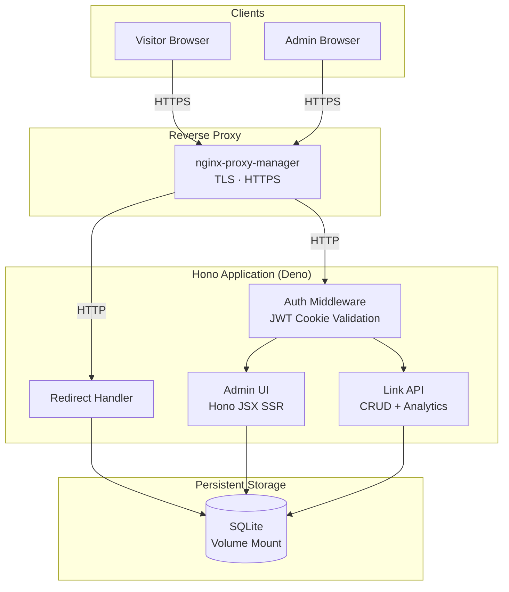
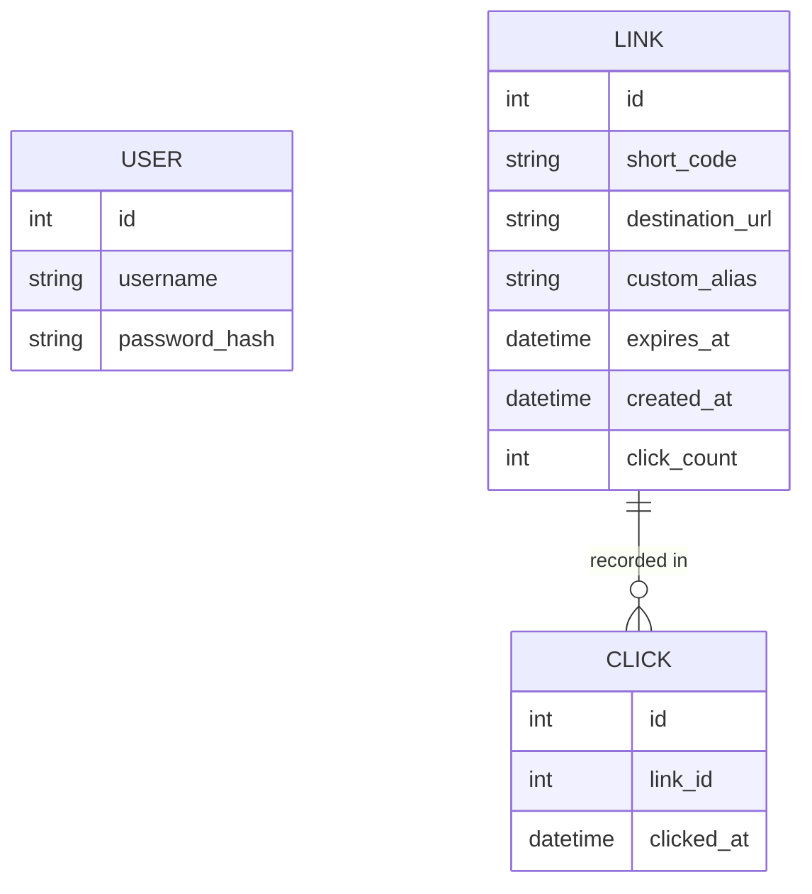

# Technical Architecture — URL Shortener

## 1. Executive Summary

This system is a personal URL shortener that converts long URLs into short,
shareable links. It exists to give a single owner full control over their own
link shortening infrastructure — no third-party tracking, no account limits, no
cost per click. The two most significant architectural choices are the use of a
single-file embedded SQLite database (keeping deployment to a single container
with no external dependencies) and a server-rendered UI using Hono JSX
(eliminating a separate frontend build pipeline). This document is intended as a
reference for the developer building and maintaining this project.

---

## 2. Goals & Constraints

### Functional Requirements

- A single authenticated user can log in via username and password.
- Authenticated user can create a short link from a destination URL, optionally
  specifying a custom alias.
- If no custom alias is provided, the system generates a random alphanumeric
  short code.
- Authenticated user can list all links with their short code, destination,
  click count, and expiry status.
- Authenticated user can edit a link's destination URL or custom alias.
- Authenticated user can delete a link.
- Authenticated user can optionally set an expiration date on a link.
- Visiting a short URL redirects the visitor to the destination via a 302
  response.
- Visiting an expired or non-existent short URL returns a 404 response.
- Each redirect is recorded with a timestamp for analytics.

### Non-Functional Requirements

- Latency: redirect response p95 < 50ms (SQLite read, single container, no
  network hop)
- Availability: best-effort single-node uptime; no HA requirement for personal
  use
- Security: all admin endpoints protected behind JWT auth; HTTPS enforced via
  reverse proxy
- Footprint: single Docker container, minimal dependencies

### Constraints

- Runtime is fixed to Deno.
- Framework is fixed to Hono.
- Database must be SQLite (no external database service).
- Deployment target is a single Docker Compose stack behind an
  nginx-proxy-manager reverse proxy.
- No multi-user or registration flow — credentials are pre-populated in the
  database.

---

## 3. System Overview

All public traffic enters through nginx-proxy-manager, which terminates TLS and
forwards requests to the Hono application.



A visitor's request for a short URL reaches the redirect handler directly (no
auth required), which looks up the short code in SQLite, records a click
timestamp, and issues a 302 to the destination. Admin requests pass through JWT
middleware before reaching the server-rendered dashboard or the link management
API.

---

## 4. Component Breakdown

### Reverse Proxy (nginx-proxy-manager)

nginx-proxy-manager is the single external entry point. It handles TLS
certificate provisioning via Let's Encrypt, HTTPS termination, and proxying all
traffic to the Hono application on its internal Docker network port. It runs as
a separate Docker Compose service (or an existing shared instance on the host)
and requires no changes to the application. No application logic lives here.

### Hono Application

The application is a single Deno process organized in four strict layers. Every
domain area (auth, links, redirect) must follow this layered structure — no
layer may skip a layer below it, and no layer may reach upward.

```
Handler  →  Service  →  Repository  →  Domain
```

| Layer                                | Responsibility                                          | May import                                                                   |
| ------------------------------------ | ------------------------------------------------------- | ---------------------------------------------------------------------------- |
| **Handler** (`src/handlers/`)        | Parse HTTP request, call service, set cookies/redirects | Service interfaces, domain classes                                           |
| **Service** (`src/services/`)        | Business logic, orchestration, validation               | Repository interfaces, domain classes, utility interfaces — no Hono, no HTTP |
| **Repository** (`src/repositories/`) | All SQL queries — maps raw DB rows to domain objects    | Domain classes, DB client only                                               |
| **Domain** (`src/domain/`)           | Plain classes representing core business entities       | Nothing — no framework, no DB, no HTTP                                       |

Domain classes are plain TypeScript classes with no dependencies. They carry
only the properties that matter to business logic — column names and DB types
are an implementation detail that stays inside the repository. The repository is
the only layer that knows about raw SQL row shapes; it maps them to domain
objects before returning.

Dependencies are injected into services via constructor parameters typed as
interfaces (not concrete classes). Concrete implementations are wired up once in
`main.ts` and passed into the Hono context via a middleware — handlers retrieve
them from `c.var`. This keeps every service unit-testable without a real
database, real bcrypt calls, or a real JWT secret.

Auth middleware runs on all `/admin/*` and `/api/*` routes. It validates the JWT
from the httpOnly cookie and rejects unauthenticated requests with a redirect to
the login page.

### SQLite Database

The database file is mounted into the container as a Docker volume. It is the
single source of truth for users, links, and click events. No separate migration
tool is used — schema is initialized on application startup via idempotent
`CREATE TABLE IF NOT EXISTS` statements.

---

## 5. Domain Model



**Relationships.** A `Link` accumulates zero or more `Click` records over its
lifetime. Each `Click` belongs to exactly one `Link`. `User` has no direct
relationship to `Link` at the data model level — since there is only one user,
ownership is implicit.

**Business Rules & Invariants**

- A `Link`'s `short_code` must be unique across all links.
- If `custom_alias` is set, it is used as the `short_code`; otherwise a random
  code is assigned at creation and stored in `short_code`.
- A `Link` with a non-null `expires_at` in the past must not redirect — it
  returns 404.
- `click_count` on `Link` is a denormalized counter that must stay in sync with
  the count of rows in `CLICK` for that link.
- A `Link`'s `destination_url` must be a valid absolute URL.

---

## 6. Data Architecture

**Core Entities**

```
users
  id            (integer, primary key, autoincrement)
  username      (text, not null, unique)
  password_hash (text, not null)
  created_at    (datetime, not null, default now)
  updated_at    (datetime, not null, default now)

links
  id              (integer, primary key, autoincrement)
  short_code      (text, not null, unique)
  destination_url (text, not null)
  custom_alias    (text, nullable, unique)
  expires_at      (datetime, nullable)
  created_at      (datetime, not null, default now)
  click_count     (integer, not null, default 0)
  updated_at    (datetime, not null, default now)

clicks
  id         (integer, primary key, autoincrement)
  link_id    (integer, not null, FK → links)
  clicked_at (datetime, not null, default now)
```

**Storage Technology Choices**

SQLite is the sole data store. It was chosen over a client-server database (e.g.
PostgreSQL) because the deployment is a single container with a single user —
there is no concurrent write contention, no network latency to a separate DB
host, and no operational overhead. The entire database is a single file on a
mounted volume, making backups a simple file copy. The Deno SQLite driver
provides a synchronous, embedded interface that fits naturally in a
single-process application.

**Data Flow**

A redirect request arrives at `GET /:code`. The handler queries `links` for a
matching `short_code`, checks `expires_at`, then performs two writes in a single
transaction: it inserts a row into `clicks` with the current timestamp and
increments `click_count` on the `links` row. The 302 response is sent
immediately after the transaction commits. There are no async side effects or
background workers.

---

## 7. Key Architectural Decisions

| Decision              | Choice                                      | Rationale                                                                                         |
| --------------------- | ------------------------------------------- | ------------------------------------------------------------------------------------------------- |
| Runtime               | Deno                                        | Built-in TypeScript, secure-by-default permissions, no `node_modules` sprawl                      |
| Framework             | Hono                                        | Lightweight, first-class Deno support, JSX SSR without a separate build step                      |
| Database              | SQLite                                      | Zero operational overhead; single-user workload has no concurrent write pressure                  |
| Session mechanism     | JWT in httpOnly cookie                      | Stateless auth with no session table; httpOnly prevents XSS token theft                           |
| Redirect type         | 302 Temporary                               | Prevents browser caching so destination edits and click counts stay accurate                      |
| Frontend approach     | Hono JSX SSR                                | No build pipeline, no JavaScript framework; HTML rendered on the server                           |
| Containerization      | Docker Compose                              | Single-file stack definition; volume mount for SQLite persistence; easy to extend                 |
| Reverse proxy         | nginx-proxy-manager                         | GUI-managed Let's Encrypt HTTPS; already running on the host, so no additional proxy setup needed |
| Short code generation | Random alphanumeric + optional custom alias | Covers both quick shortening and memorable vanity links                                           |

---

## 8. Security & Compliance

**Authentication.** The application uses username/password authentication
against a bcrypt-hashed credential stored in SQLite. On successful login, the
server issues a JWT signed with a secret key (HS256) and sets it as an httpOnly,
Secure, SameSite=Strict cookie. The JWT payload carries only the user ID and an
expiry claim. The signing secret is provided via environment variable and never
committed to source control.

**Authorization.** There is a single authorization role: the owner. All
`/admin/*` and `/api/*` routes are protected by a Hono middleware that validates
the JWT cookie on every request. Unauthenticated requests are redirected to the
login page. The public redirect route (`GET /:code`) requires no authentication.

**Secrets management.** The JWT signing secret and the pre-populated admin
password are provided as environment variables at container runtime, defined in
a `.env` file that is excluded from version control via `.gitignore`. Docker
Compose reads from the `.env` file and injects variables into the container
environment.

**Data protection.** All traffic is encrypted in transit via HTTPS enforced by
nginx-proxy-manager. The SQLite file at rest is not encrypted at the OS level;
for a personal-use hobby project this is an accepted trade-off, but full-disk
encryption on the host provides equivalent protection. No PII beyond click
timestamps is stored. The admin password is stored as a bcrypt hash; it is never
stored or logged in plaintext.

---

## 9. Observability

**Logging.** The application logs to stdout in structured JSON format. Every log
line includes a timestamp, log level, and a short message. Redirect events are
logged at INFO level with the short code and HTTP status. Auth failures are
logged at WARN level. Docker captures stdout and makes it available via
`docker compose logs`. For a personal project, no log shipping to an external
service is required.

**Metrics.** No dedicated metrics agent is used. The `click_count` column on
`links` and the `clicks` table serve as the primary operational signal — they
can be queried directly in the admin UI. No external dashboard is provisioned.

**Tracing.** Distributed tracing is not applicable for a single-process,
single-container application. Request lifecycle is fully observable from logs.

**Alerting.** No automated alerting is configured. The most operationally
important signal for this system is redirect latency — if the SQLite query on
the hot path degrades, short URLs stop being useful. Manual monitoring via
`docker compose logs` is sufficient for personal use.

---

## 10. Error Handling Conventions

Services never throw. When an operation fails due to a business rule or expected
condition (invalid credentials, not found, duplicate alias), the service returns
an `Error` instance as a plain value. The caller — always a handler — checks
`instanceof Error` and decides the HTTP response. Unexpected errors (DB crashes,
programming mistakes) are the only errors that propagate as thrown exceptions;
those are not caught in handlers and will surface as 500s.

```typescript
// Service — return Error as value, never throw for business failures
async login(username: string, password: string): Promise<string | Error> {
  const user = this.repo.findByUsername(username)
  if (!user) return new Error('invalid credentials')

  const valid = await this.password.compare(password, user.password_hash)
  if (!valid) return new Error('invalid credentials')

  return this.jwt.sign(user.id)
}

// Handler — check instanceof Error, handle HTTP concerns
const result = await c.var.authService.login(username, password)
if (result instanceof Error) return c.redirect('/login?error=1', 302)

setCookie(c, 'token', result, { ... })
return c.redirect('/admin', 302)
```

The return type of every service method that can fail must be `T | Error`. A
handler that receives `T | Error` must narrow the type with `instanceof Error`
before using the success value — the TypeScript compiler will enforce this.

---

## 11. Testing Expectations

Unit tests cover services only. Handlers and repositories are not unit tested —
handlers are thin HTTP wiring and repositories are thin SQL wrappers; both are
better covered by integration or end-to-end tests when those are added.

A service is testable because all its dependencies are injected interfaces.
Tests construct a service with stub implementations of those interfaces — no
real database, no real bcrypt, no `JWT_SECRET` environment variable required.
Stubs are plain inline objects; no mocking library is needed.

```typescript
// Stub factory pattern used in all service tests
const makeRepo = (user?: User): UserRepository => ({
  findByUsername: () => user,
});

const makeJwt = (overrides?: Partial<JwtUtils>): JwtUtils => ({
  sign: () => Promise.resolve("signed-token"),
  verify: () => Promise.resolve({ sub: "1" }),
  ...overrides,
});

const makePassword = (valid: boolean): PasswordUtils => ({
  compare: () => Promise.resolve(valid),
});

// Test — construct service with stubs, assert return value
Deno.test("login - returns error when password is wrong", async () => {
  const service = new AuthService(
    makeRepo({ id: 1, password_hash: "hash" }),
    makeJwt(),
    makePassword(false),
  );
  const result = await service.login("user", "wrong");
  expect(result).toBeInstanceOf(Error);
});

// Domain objects are constructed directly in tests — no raw row shapes
const user = new User(1, "hash");
```

Test files live alongside the module they test (`auth.service.test.ts` next to
`auth.service.ts`). The test runner is `deno task test`. Assertions use
`@std/expect` for a Jest-compatible `expect` API.

---

## 12. Appendix: Project Structure

```
url-shortener/
├── main.ts                     # Application entry point, Hono app bootstrap
├── deno.json                   # Deno config, import map, task definitions
├── docker-compose.yml          # Stack definition: app + volume mount
├── Dockerfile                  # Deno runtime image, non-root user
├── .env.example                # Required env vars with placeholder values
├── src/
│   ├── context.ts              # Hono Variables interface (injected services)
│   ├── db/
│   │   ├── client.ts           # SQLite connection singleton
│   │   └── schema.ts           # CREATE TABLE IF NOT EXISTS statements
│   ├── middleware/
│   │   └── auth.ts             # JWT cookie validation middleware
│   ├── domain/                 # Plain domain classes — no framework, no DB deps
│   │   └── user.ts             # User domain object
│   ├── repositories/           # SQL queries — maps raw rows to domain objects
│   │   └── user.repository.ts  # UserRepository interface + SqliteUserRepository
│   ├── services/               # Business logic — unit testable, no HTTP/DB imports
│   │   ├── auth.service.ts     # AuthService: login, verifyToken
│   │   └── auth.service.test.ts
│   ├── handlers/               # HTTP layer — parse request, call service, respond
│   │   ├── auth.tsx            # Login / logout handlers
│   │   ├── redirect.ts         # Short code lookup, click recording, 302
│   │   ├── links.ts            # CRUD API handlers
│   │   └── admin.ts            # Server-rendered admin UI handlers
│   ├── views/                  # Hono JSX components / page templates
│   │   ├── layout.tsx
│   │   ├── login.tsx
│   │   └── dashboard.tsx
│   └── utils/
│       ├── codegen.ts          # Random short code generation
│       └── jwt.ts              # JWT sign / verify helpers
└── docs/
    └── technical-architecture.md
```

---

_This document should be reviewed and updated on any major architectural
change._
